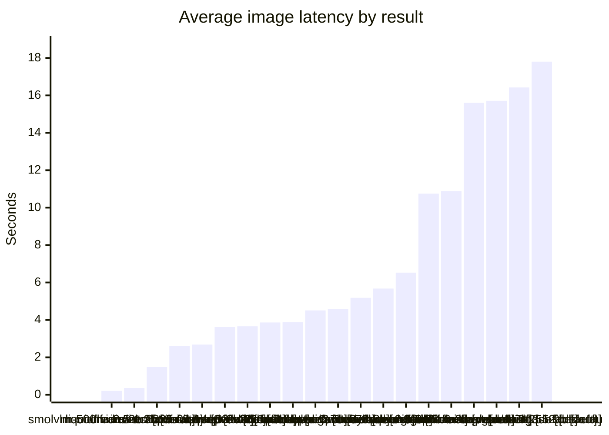

# mac-bench Vision Benchmark

- Ran at: `2026-03-24 09:27:28 UTC`
- Finished at: `2026-03-24 09:48:58 UTC`
- Duration: `0:21:29.705015`
- Machine: `Mac mini` / `Apple M4 Pro` / `64 GB RAM`

## What This Run Tested

- Request profile: `default`
- Temperature: `0.0`
- Max tokens: `160`
- Images: `5`

## Prompt

```text
Describe only the visible person or people in this image in 1 to 2 short sentences. Mention clothing, hats, glasses, masks, shoes, bags, boxes, phones, packages, or other objects they are wearing or carrying. Do not mention the environment, house, porch, background, weather, doorway, camera overlay, or timestamp text unless it is strictly necessary to identify an object on the person. If something is uncertain, say probably or possibly. If no person is visible, reply with exactly: No person visible.
```

## Recommendation

- Recommended result: `liquid/lfm2.5-1.2b` / `default` at `0.359s` average latency.
- Why: Fastest stable result within the 32 GiB target.
- Lightest stable result: `liquid/lfm2.5-1.2b` / `default` at `1.16 GiB`.

## Charts

### Speed vs Memory

```mermaid
quadrantChart
    title Speed vs memory footprint
    x-axis Slow --> Fast
    y-axis Low RAM --> High RAM
    quadrant-1 Fast but heavy
    quadrant-2 Best zone
    quadrant-3 Light but slower
    quadrant-4 Heavy and slower
    "liquid/lfm2.5-1.2b [default]": [1.000, 0.000]
    "moondream-2b-2025-04-14 [default]": [0.936, 0.108]
    "nvidia/nemotron-3-nano [default]": [0.871, 0.716]
    "mistralai/ministral-3-3b [default]": [0.867, 0.075]
    "qwen/qwen3-vl-4b [default]": [0.813, 0.081]
    "minicpm-v-2_6 [default]": [0.811, 0.194]
    "qwen2-vl-2b-instruct [default]": [0.799, 0.001]
    "qwen2.5-vl-3b-instruct [default]": [0.798, 0.080]
    "allenai/olmocr-2-7b [default]": [0.762, 0.207]
    "qwen/qwen2.5-vl-7b [default]": [0.758, 0.207]
    "qwen/qwen3-vl-8b [default]": [0.724, 0.196]
    "paligemma-3b-mix-448 [default]": [0.695, 0.083]
    "mlx-community/qwen2.5-vl-7b-instruct [default]": [0.646, 0.334]
    "qwen/qwen3.5-35b-a3b [default]": [0.404, 0.901]
    "zai-org/glm-4.6v-flash [default]": [0.396, 0.253]
    "microsoft/phi-4-mini-reasoning [default]": [0.126, 0.040]
    "mistralai/devstral-small-2-2512 [default]": [0.120, 0.557]
    "zai-org/glm-4.7-flash [default]": [0.079, 1.000]
    "qwen/qwen3.5-9b [default]": [0.000, 0.230]
```

### Average Latency



## Summary

| Model | Profile | Format | Load RAM GiB | Avg s | Median s | Tok/s | Success | Reasoning |
|---|---|---|---:|---:|---:|---:|---:|---|
| `smolvlm-500m-instruct` | `default` | `gguf` | - | 0.211 | 0.198 | 78.822 | 5/5 | no |
| `liquid/lfm2.5-1.2b` | `default` | `safetensors` | 1.160 | 0.359 | 0.350 | 80.870 | 5/5 | no |
| `moondream-2b-2025-04-14` | `default` | `gguf` | 3.490 | 1.476 | 1.470 | 48.109 | 5/5 | no |
| `nvidia/nemotron-3-nano` | `default` | `safetensors` | 16.570 | 2.601 | 2.162 | 61.121 | 5/5 | yes |
| `mistralai/ministral-3-3b` | `default` | `gguf` | 2.780 | 2.684 | 2.725 | 15.052 | 5/5 | no |
| `qwen/qwen3-vl-4b` | `default` | `safetensors` | 2.900 | 3.617 | 3.869 | 8.848 | 5/5 | no |
| `minicpm-v-2_6` | `default` | `gguf` | 5.330 | 3.657 | 3.558 | 9.461 | 5/5 | no |
| `qwen2-vl-2b-instruct` | `default` | `safetensors` | 1.180 | 3.862 | 4.139 | 10.617 | 5/5 | no |
| `qwen2.5-vl-3b-instruct` | `default` | `safetensors` | 2.880 | 3.883 | 4.132 | 4.532 | 5/5 | no |
| `allenai/olmocr-2-7b` | `default` | `gguf` | 5.620 | 4.508 | 4.580 | 4.747 | 5/5 | no |
| `qwen/qwen2.5-vl-7b` | `default` | `gguf` | 5.620 | 4.586 | 4.647 | 5.538 | 5/5 | no |
| `qwen/qwen3-vl-8b` | `default` | `safetensors` | 5.380 | 5.182 | 5.534 | 5.017 | 5/5 | no |
| `paligemma-3b-mix-448` | `default` | `safetensors` | 2.950 | 5.676 | 6.744 | 0.705 | 5/5 | no |
| `mlx-community/qwen2.5-vl-7b-instruct` | `default` | `safetensors` | 8.340 | 6.526 | 6.787 | 3.984 | 5/5 | no |
| `qwen/qwen3.5-35b-a3b` | `default` | `gguf` | 20.560 | 10.749 | 11.289 | 34.589 | 5/5 | yes |
| `zai-org/glm-4.6v-flash` | `default` | `safetensors` | 6.610 | 10.888 | 10.346 | 13.666 | 5/5 | yes |
| `microsoft/phi-4-mini-reasoning` | `default` | `safetensors` | 2.030 | 15.606 | 15.513 | 85.352 | 5/5 | yes |
| `mistralai/devstral-small-2-2512` | `default` | `safetensors` | 13.150 | 15.710 | 15.601 | 1.948 | 5/5 | no |
| `zai-org/glm-4.7-flash` | `default` | `safetensors` | 22.680 | 16.424 | 16.393 | 48.769 | 5/5 | yes |
| `qwen/qwen3.5-9b` | `default` | `gguf` | 6.100 | 17.803 | 17.455 | 26.198 | 5/5 | yes |
| `nanollava` | `default` | `safetensors` | 1.970 | - | - | - | 0/5 | no |
| `phi-3.5-vision-instruct` | `default` | `safetensors` | 2.180 | - | - | - | 0/5 | no |
| `bunny-llama-3-8b-v` | `default` | `safetensors` | 4.470 | - | - | - | 0/5 | no |
| `meta-llama-3.1-8b-instruct-hf` | `default` | `gguf` | 4.580 | - | - | - | 0/5 | no |
| `internvl3_5-1b` | `default` | `safetensors` | - | - | - | - | 0/0 | no |
| `smolvlm2-2.2b-instruct-mlx` | `default` | `safetensors` | - | - | - | - | 0/0 | no |
| `smolvlm2-256m-video-instruct-mlx` | `default` | `safetensors` | - | - | - | - | 0/0 | no |
| `smolvlm2-500m-video-instruct-mlx` | `default` | `safetensors` | - | - | - | - | 0/0 | no |

## Images

- `sample-01.jpg`
- `sample-02.jpg`
- `sample-03.jpg`
- `sample-04.jpg`
- `sample-05.jpg`

## SmolVLM 500M Instruct / default

- Model key: `smolvlm-500m-instruct`
- Identifier used for API: `bench-smolvlm-500m-instruct`
- Format: `gguf`
- Params: `500M`
- Average image latency: `0.211s`
- Median image latency: `0.198s`
- Completion throughput: `78.822 tokens/s`
- Success rate: `5/5`

| Image | Time s | Prompt Tokens | Completion Tokens | Reasoning | Response |
|---|---:|---:|---:|---|---|
| `sample-01.jpg` | 0.288 | 184 | 25 | no | A man wearing a hoodie and gloves is opening the door for someone. He has a box in his left hand. |
| `sample-02.jpg` | 0.199 | 184 | 18 | no | A man in a black jacket and cap walks into his house carrying a brown bag. |
| `sample-03.jpg` | 0.171 | 184 | 10 | no | A person is loading boxes into a car. |
| `sample-04.jpg` | 0.197 | 184 | 15 | no | A man in a safety vest is holding some boxes near a door. |
| `sample-05.jpg` | 0.198 | 184 | 15 | no | A home's front door has been cleaned and boxed for delivery. |

## Lfm2.5 1.2B / default

- Model key: `liquid/lfm2.5-1.2b`
- Identifier used for API: `bench-liquid-lfm2-5-1-2b`
- Format: `safetensors`
- Variant: `liquid/lfm2.5-1.2b@8bit`
- Params: `1.2B`
- Estimated total memory: `1.63 GiB`
- Reported load memory: `1.16 GiB`
- Load time: `2.21s`
- Average image latency: `0.359s`
- Median image latency: `0.350s`
- Completion throughput: `80.870 tokens/s`
- Success rate: `5/5`

| Image | Time s | Prompt Tokens | Completion Tokens | Reasoning | Response |
|---|---:|---:|---:|---|---|
| `sample-01.jpg` | 0.396 | 118 | 29 | no | Probably a person wearing casual clothing, possibly with a hat and glasses; they might have a mask on and carrying a bag or phone. |
| `sample-02.jpg` | 0.341 | 118 | 29 | no | Probably a person wearing casual clothing, possibly with a hat and glasses; they might have a mask on and carrying a bag or phone. |
| `sample-03.jpg` | 0.350 | 118 | 29 | no | Probably a person wearing casual clothing, possibly with a hat and glasses; they might have a mask on and carrying a bag or phone. |
| `sample-04.jpg` | 0.357 | 118 | 29 | no | Probably a person wearing casual clothing, possibly with a hat and glasses; they might have a mask on and carrying a bag or phone. |
| `sample-05.jpg` | 0.349 | 118 | 29 | no | Probably a person wearing casual clothing, possibly with a hat and glasses; they might have a mask on and carrying a bag or phone. |

## Moondream2 Text Model / default

- Model key: `moondream-2b-2025-04-14`
- Identifier used for API: `bench-moondream-2b-2025-04-14`
- Format: `gguf`
- Params: `2B`
- Estimated total memory: `3.84 GiB`
- Reported load memory: `3.49 GiB`
- Load time: `1.78s`
- Average image latency: `1.476s`
- Median image latency: `1.470s`
- Completion throughput: `48.109 tokens/s`
- Success rate: `5/5`

| Image | Time s | Prompt Tokens | Completion Tokens | Reasoning | Response |
|---|---:|---:|---:|---|---|
| `sample-01.jpg` | 1.470 | 847 | 66 | no | The image shows a man standing outside of a house holding a package in his hand and opening a door to enter the home. He appears to be wearing a hoodie and gloves as he carries out this task. The scene suggests that the man might be a delivery person or a carrier, responsible for bringing packages into the residence. |
| `sample-02.jpg` | 1.488 | 847 | 74 | no | The image shows a man walking into his house while holding a bag in one hand and a cell phone in the other. The scene appears to be captured at night, as evidenced by the dark surroundings and the presence of streetlights illuminating the area. The man's actions suggest that he might have just arrived home or is about to enter it after completing some errands. |
| `sample-03.jpg` | 1.424 | 847 | 67 | no | The image shows a man standing in front of his door holding two cardboard boxes. He appears to be either preparing for delivery or picking up items from someone's house. The scene takes place on a porch, which has potted plants and a rug placed nearby. There is also a clock visible in the background, indicating the time. |
| `sample-04.jpg` | 1.548 | 847 | 77 | no | The image shows a man standing outside of a house at night, holding a package in his hand. He appears to be delivering mail or perhaps picking up a package from the homeowner. The scene takes place on a porch, which has an arched doorway and is illuminated by a light fixture hanging above it. There are also some potted plants visible near the entrance of the house. |
| `sample-05.jpg` | 1.449 | 847 | 71 | no | The image shows a front door of a house with two packages sitting on the porch. The packages are brown and appear to be cardboard boxes. There is also a potted plant placed near the packages, adding some greenery to the scene. A bench can be seen in the background, providing a place for people to sit and relax outside the home. |

## Nemotron 3 Nano / default

- Model key: `nvidia/nemotron-3-nano`
- Identifier used for API: `bench-nvidia-nemotron-3-nano`
- Format: `safetensors`
- Variant: `nvidia/nemotron-3-nano@4bit`
- Params: `30B`
- Estimated total memory: `23.20 GiB`
- Reported load memory: `16.57 GiB`
- Load time: `8.26s`
- Average image latency: `2.601s`
- Median image latency: `2.162s`
- Completion throughput: `61.121 tokens/s`
- Success rate: `5/5`

| Image | Time s | Prompt Tokens | Completion Tokens | Reasoning | Response |
|---|---:|---:|---:|---|---|
| `sample-01.jpg` | 4.389 | 124 | 159 | yes | No person visible. |
| `sample-02.jpg` | 2.139 | 124 | 159 | yes | No person visible. |
| `sample-03.jpg` | 2.172 | 124 | 159 | yes | No person visible. |
| `sample-04.jpg` | 2.145 | 124 | 159 | yes | No person visible. |
| `sample-05.jpg` | 2.162 | 124 | 159 | yes | No person visible. |

## Ministral 3 3B / default

- Model key: `mistralai/ministral-3-3b`
- Identifier used for API: `bench-mistralai-ministral-3-3b`
- Format: `gguf`
- Variant: `mistralai/ministral-3-3b@q4_k_m`
- Params: `3B`
- Estimated total memory: `3.01 GiB`
- Reported load memory: `2.78 GiB`
- Load time: `1.65s`
- Average image latency: `2.684s`
- Median image latency: `2.725s`
- Completion throughput: `15.052 tokens/s`
- Success rate: `5/5`

| Image | Time s | Prompt Tokens | Completion Tokens | Reasoning | Response |
|---|---:|---:|---:|---|---|
| `sample-01.jpg` | 3.227 | 1656 | 44 | no | A man in a dark gray hooded jacket and black gloves is holding a wooden box labeled "UPS" near his body while opening a door. He wears a black cap and appears to be wearing sneakers. |
| `sample-02.jpg` | 2.596 | 1656 | 43 | no | The individual in the image is wearing a dark hooded jacket, a black cap, and appears to be holding a smartphone while standing near an open door. They have a brown paper bag hanging from one hand. |
| `sample-03.jpg` | 2.725 | 1656 | 55 | no | A person in a dark long-sleeved shirt and rolled-up pants is carrying two stacked cardboard boxes while wearing sneakers. The upper body is not fully visible, but there are no hats, glasses, masks, bags, phones, or packages clearly attached to them. |
| `sample-04.jpg` | 2.750 | 1656 | 55 | no | A person in a dark jacket, light-colored reflective vest, and brown pants stands holding what appears to be a clipboard or document. They are wearing a white cap and possibly black shoes; they do not have any visible bags, masks, glasses, phones, or packages. |
| `sample-05.jpg` | 2.122 | 1656 | 5 | no | No person visible. |

## Qwen3 VL 4B / default

- Model key: `qwen/qwen3-vl-4b`
- Identifier used for API: `bench-qwen-qwen3-vl-4b`
- Format: `safetensors`
- Variant: `qwen/qwen3-vl-4b@4bit`
- Params: `4B`
- Estimated total memory: `4.05 GiB`
- Reported load memory: `2.90 GiB`
- Load time: `4.05s`
- Average image latency: `3.617s`
- Median image latency: `3.869s`
- Completion throughput: `8.848 tokens/s`
- Success rate: `5/5`

| Image | Time s | Prompt Tokens | Completion Tokens | Reasoning | Response |
|---|---:|---:|---:|---|---|
| `sample-01.jpg` | 2.614 | 117 | 38 | no | A man wearing a dark hooded jacket, a cap, and gloves is holding a cardboard box in one hand and using the other to turn a door handle, likely delivering a package. |
| `sample-02.jpg` | 3.869 | 117 | 32 | no | A person wearing a black hooded jacket, a black cap, and carrying a brown paper bag is standing outside, looking at a smartphone in their hand. |
| `sample-03.jpg` | 3.911 | 117 | 34 | no | A man in a dark hoodie and muddy cargo pants is handling two stacked cardboard boxes, wearing worn sneakers, and appears to be placing or adjusting them on the doorstep. |
| `sample-04.jpg` | 4.123 | 117 | 51 | no | A man wearing a white cap, a black jacket with a bright yellow reflective vest, and dark pants is standing on a porch, holding an Amazon package in his right hand. He is wearing dark shoes and appears to be preparing to deliver the package. |
| `sample-05.jpg` | 3.567 | 117 | 5 | no | No person visible. |

## MiniCPM V 2 6 / default

- Model key: `minicpm-v-2_6`
- Identifier used for API: `bench-minicpm-v-2-6`
- Format: `gguf`
- Params: `7.6B`
- Estimated total memory: `5.61 GiB`
- Reported load memory: `5.33 GiB`
- Load time: `2.61s`
- Average image latency: `3.657s`
- Median image latency: `3.558s`
- Completion throughput: `9.461 tokens/s`
- Success rate: `5/5`

| Image | Time s | Prompt Tokens | Completion Tokens | Reasoning | Response |
|---|---:|---:|---:|---|---|
| `sample-01.jpg` | 3.558 | 578 | 19 | no | A man in a green jacket and black hat holds a box while standing at a door. |
| `sample-02.jpg` | 3.327 | 578 | 23 | no | A man in a black jacket and hat carrying two bags walks towards his front door while looking at his phone. |
| `sample-03.jpg` | 4.019 | 578 | 54 | no | A man in a black jacket and cargo pants bends over as he stacks cardboard boxes on top of each other by the front door. The date stamp indicates this photo was taken October 26, 2023 at about 14:32. |
| `sample-04.jpg` | 3.427 | 578 | 26 | no | A man in a yellow vest and black jacket holds two packages at his side as he stands on the porch of a house. |
| `sample-05.jpg` | 3.955 | 578 | 51 | no | No one is in this picture. There are some boxes and a bag outside of a house on the porch. The date and time stamp at top left corner says May 15, 2024 at 3:29 pm. |

## Qwen2 VL 2B Instruct / default

- Model key: `qwen2-vl-2b-instruct`
- Identifier used for API: `bench-qwen2-vl-2b-instruct`
- Format: `safetensors`
- Params: `2B`
- Estimated total memory: `1.65 GiB`
- Reported load memory: `1.18 GiB`
- Load time: `3.38s`
- Average image latency: `3.862s`
- Median image latency: `4.139s`
- Completion throughput: `10.617 tokens/s`
- Success rate: `5/5`

| Image | Time s | Prompt Tokens | Completion Tokens | Reasoning | Response |
|---|---:|---:|---:|---|---|
| `sample-01.jpg` | 2.756 | 128 | 38 | no | A man wearing a dark hoodie and black gloves is holding a brown box. He is pointing at the door handle with his left hand. There are no other people visible in this image. |
| `sample-02.jpg` | 4.139 | 128 | 35 | no | A person wearing a black jacket and hat is carrying a brown bag, possibly holding a phone. The background shows a brick house with a wooden door and a light fixture. |
| `sample-03.jpg` | 4.296 | 128 | 68 | no | A man wearing a black hoodie and gray cargo pants is bending over to pick up two cardboard boxes on the porch of a house. The boxes are stacked, and there is a doormat with the word "HOME" written on it. The man has no visible face, and there are no other people or objects in the image. |
| `sample-04.jpg` | 4.211 | 128 | 55 | no | A man wearing a white cap, yellow vest, and gray pants is holding two boxes. He stands in front of a brick house with an arched doorway and a wooden door, wearing black shoes. The scene is nighttime, and the man appears to be delivering packages. |
| `sample-05.jpg` | 3.906 | 128 | 9 | no | There are no people in the image. |

## Qwen2.5 VL 3B Instruct / default

- Model key: `qwen2.5-vl-3b-instruct`
- Identifier used for API: `bench-qwen2-5-vl-3b-instruct`
- Format: `safetensors`
- Params: `3B`
- Estimated total memory: `4.03 GiB`
- Reported load memory: `2.88 GiB`
- Load time: `3.68s`
- Average image latency: `3.883s`
- Median image latency: `4.132s`
- Completion throughput: `4.532 tokens/s`
- Success rate: `5/5`

| Image | Time s | Prompt Tokens | Completion Tokens | Reasoning | Response |
|---|---:|---:|---:|---|---|
| `sample-01.jpg` | 2.805 | 128 | 27 | no | A man wearing a black hoodie and gloves is opening the door with his right hand while holding a cardboard box in his left hand. |
| `sample-02.jpg` | 4.230 | 128 | 19 | no | A person wearing a black jacket and cap is holding a smartphone and a brown paper bag. |
| `sample-03.jpg` | 4.132 | 128 | 19 | no | A person wearing a dark hoodie and camouflage pants is placing two cardboard boxes on the porch. |
| `sample-04.jpg` | 4.139 | 128 | 18 | no | A man wearing a high-visibility vest and a cap is holding an Amazon box. |
| `sample-05.jpg` | 4.110 | 128 | 5 | no | No person visible. |

## Olmocr 2 7B / default

- Model key: `allenai/olmocr-2-7b`
- Identifier used for API: `bench-allenai-olmocr-2-7b`
- Format: `gguf`
- Variant: `allenai/olmocr-2-7b@q4_k_m`
- Params: `7B`
- Estimated total memory: `5.90 GiB`
- Reported load memory: `5.62 GiB`
- Load time: `2.95s`
- Average image latency: `4.508s`
- Median image latency: `4.580s`
- Completion throughput: `4.747 tokens/s`
- Success rate: `5/5`

| Image | Time s | Prompt Tokens | Completion Tokens | Reasoning | Response |
|---|---:|---:|---:|---|---|
| `sample-01.jpg` | 4.580 | 1278 | 18 | no | A man in a dark jacket and gloves is opening a door while holding a package. |
| `sample-02.jpg` | 4.664 | 1278 | 24 | no | A person wearing a dark jacket, hat, and possibly a mask is holding a phone and a brown paper bag. |
| `sample-03.jpg` | 4.859 | 1278 | 37 | no | A man is bending over, placing a cardboard box on top of another box on a porch. He is wearing a dark long-sleeve shirt, cargo pants, and sneakers. |
| `sample-04.jpg` | 4.420 | 1278 | 23 | no | A man wearing a white baseball cap, a yellow safety vest, and dark pants is holding an Amazon box. |
| `sample-05.jpg` | 4.016 | 1278 | 5 | no | No person visible. |

## Qwen2.5 VL 7B / default

- Model key: `qwen/qwen2.5-vl-7b`
- Identifier used for API: `bench-qwen-qwen2-5-vl-7b`
- Format: `gguf`
- Variant: `qwen/qwen2.5-vl-7b@q4_k_m`
- Params: `7B`
- Estimated total memory: `5.90 GiB`
- Reported load memory: `5.62 GiB`
- Load time: `2.97s`
- Average image latency: `4.586s`
- Median image latency: `4.647s`
- Completion throughput: `5.538 tokens/s`
- Success rate: `5/5`

| Image | Time s | Prompt Tokens | Completion Tokens | Reasoning | Response |
|---|---:|---:|---:|---|---|
| `sample-01.jpg` | 4.909 | 1278 | 34 | no | A man wearing a dark hoodie and gloves holds a package in his left hand while opening a door with his right hand. He appears to be delivering mail or packages. |
| `sample-02.jpg` | 4.647 | 1278 | 25 | no | A person wearing a dark jacket and hat holds a phone in one hand while carrying a brown paper bag in the other. |
| `sample-03.jpg` | 4.725 | 1278 | 31 | no | A man wearing a dark hoodie and camouflage pants is bending over to place two cardboard boxes on a doormat. He appears to be wearing sneakers. |
| `sample-04.jpg` | 4.585 | 1278 | 32 | no | A man wearing a white cap, yellow safety vest over dark clothing, and brown shoes stands in front of a door holding a cardboard box labeled "Amazon." |
| `sample-05.jpg` | 4.066 | 1278 | 5 | no | No person visible. |

## Qwen3 VL 8B / default

- Model key: `qwen/qwen3-vl-8b`
- Identifier used for API: `bench-qwen-qwen3-vl-8b`
- Format: `safetensors`
- Variant: `qwen/qwen3-vl-8b@4bit`
- Params: `8B`
- Estimated total memory: `7.53 GiB`
- Reported load memory: `5.38 GiB`
- Load time: `4.14s`
- Average image latency: `5.182s`
- Median image latency: `5.534s`
- Completion throughput: `5.017 tokens/s`
- Success rate: `5/5`

| Image | Time s | Prompt Tokens | Completion Tokens | Reasoning | Response |
|---|---:|---:|---:|---|---|
| `sample-01.jpg` | 4.064 | 117 | 28 | no | A man wearing a dark hooded jacket, a baseball cap, and gloves is holding a cardboard box and reaching for a door handle. |
| `sample-02.jpg` | 5.534 | 117 | 30 | no | A person wearing a dark hooded jacket and a baseball cap is holding a smartphone in one hand and carrying a brown paper bag in the other. |
| `sample-03.jpg` | 5.639 | 117 | 34 | no | A person wearing a dark hoodie, dark pants, and light-colored sneakers is bending over, placing a cardboard box on top of another box on a doormat. |
| `sample-04.jpg` | 5.585 | 117 | 33 | no | A man wearing a cap, a high-visibility vest over a dark jacket, and dark pants is holding a cardboard Amazon package. He is wearing dark shoes. |
| `sample-05.jpg` | 5.089 | 117 | 5 | no | No person visible. |

## Paligemma 3B Mix 448 / default

- Model key: `paligemma-3b-mix-448`
- Identifier used for API: `bench-paligemma-3b-mix-448`
- Format: `safetensors`
- Params: `3B`
- Estimated total memory: `4.13 GiB`
- Reported load memory: `2.95 GiB`
- Load time: `6.54s`
- Average image latency: `5.676s`
- Median image latency: `6.744s`
- Completion throughput: `0.705 tokens/s`
- Success rate: `5/5`

| Image | Time s | Prompt Tokens | Completion Tokens | Reasoning | Response |
|---|---:|---:|---:|---|---|
| `sample-01.jpg` | 1.590 | 119 | 4 | no | unanswerable |
| `sample-02.jpg` | 6.441 | 119 | 4 | no | unanswerable |
| `sample-03.jpg` | 6.749 | 119 | 4 | no | no person visible |
| `sample-04.jpg` | 6.857 | 119 | 4 | no | unanswerable |
| `sample-05.jpg` | 6.744 | 119 | 4 | no | no person visible |

## Qwen2.5 VL 7B Instruct / default

- Model key: `mlx-community/qwen2.5-vl-7b-instruct`
- Identifier used for API: `bench-mlx-community-qwen2-5-vl-7b-instruct`
- Format: `safetensors`
- Params: `7B`
- Estimated total memory: `11.68 GiB`
- Reported load memory: `8.34 GiB`
- Load time: `4.90s`
- Average image latency: `6.526s`
- Median image latency: `6.787s`
- Completion throughput: `3.984 tokens/s`
- Success rate: `5/5`

| Image | Time s | Prompt Tokens | Completion Tokens | Reasoning | Response |
|---|---:|---:|---:|---|---|
| `sample-01.jpg` | 5.599 | 128 | 40 | no | The person is wearing a dark hoodie, gloves, and possibly a hat or hood. They are holding a cardboard box in one hand while opening the door with the other, which is gloved. |
| `sample-02.jpg` | 6.940 | 128 | 31 | no | The person is wearing a dark jacket, possibly a hood, and holding a phone in their right hand. They are also carrying a brown paper bag. |
| `sample-03.jpg` | 6.787 | 128 | 26 | no | The person is wearing a dark hoodie, camouflage pants, and possibly sneakers. They are handling two cardboard boxes on the porch. |
| `sample-04.jpg` | 6.961 | 128 | 28 | no | The person is wearing a yellow safety vest, dark pants, and brown shoes. They are holding an Amazon package in their right hand. |
| `sample-05.jpg` | 6.343 | 128 | 5 | no | No person visible. |

## Qwen3.5 35B A3B / default

- Model key: `qwen/qwen3.5-35b-a3b`
- Identifier used for API: `bench-qwen-qwen3-5-35b-a3b`
- Format: `gguf`
- Variant: `qwen/qwen3.5-35b-a3b@q4_k_m`
- Params: `35B-A3B`
- Estimated total memory: `21.25 GiB`
- Reported load memory: `20.56 GiB`
- Load time: `10.10s`
- Average image latency: `10.749s`
- Median image latency: `11.289s`
- Completion throughput: `34.589 tokens/s`
- Success rate: `5/5`

| Image | Time s | Prompt Tokens | Completion Tokens | Reasoning | Response |
|---|---:|---:|---:|---|---|
| `sample-01.jpg` | 10.006 | 999 | 342 | yes | A man wearing a dark green zip-up jacket over a black hoodie and a baseball cap stands at a door. He wears black gloves and holds a brown cardboard box in one hand while reaching for the handle with the other. |
| `sample-02.jpg` | 12.373 | 999 | 456 | yes | A person wearing a dark puffy jacket with the hood pulled up over a baseball cap and dark pants is looking at a lit smartphone held in their hands. They are also carrying a brown paper bag in one hand. |
| `sample-03.jpg` | 11.305 | 999 | 401 | yes | A person wearing a dark long-sleeved shirt and camouflage cargo pants is bending over to handle two stacked cardboard boxes. They are wearing light-colored sneakers. |
| `sample-04.jpg` | 11.289 | 999 | 400 | yes | A man wearing a white-fronted baseball cap and a yellow reflective safety vest over dark clothing stands facing a door. He is holding two cardboard boxes in his hands while wearing dark pants and shoes. |
| `sample-05.jpg` | 8.773 | 999 | 260 | yes | No person visible. |

## Glm 4.6v Flash / default

- Model key: `zai-org/glm-4.6v-flash`
- Identifier used for API: `bench-zai-org-glm-4-6v-flash`
- Format: `safetensors`
- Variant: `zai-org/glm-4.6v-flash@4bit`
- Params: `9B`
- Estimated total memory: `9.25 GiB`
- Reported load memory: `6.61 GiB`
- Load time: `6.33s`
- Average image latency: `10.888s`
- Median image latency: `10.346s`
- Completion throughput: `13.666 tokens/s`
- Success rate: `5/5`

| Image | Time s | Prompt Tokens | Completion Tokens | Reasoning | Response |
|---|---:|---:|---:|---|---|
| `sample-01.jpg` | 14.209 | 115 | 284 | yes | A man wears a dark hooded jacket, black cap under the hood, and gloves. He holds a cardboard box in one arm while touching the door handle with the other hand. |
| `sample-02.jpg` | 12.151 | 115 | 204 | yes | A person wearing a dark hooded jacket and a dark cap holds a smartphone with a blue screen while carrying a brown paper bag. |
| `sample-03.jpg` | 10.346 | 115 | 123 | yes | A person wearing a dark hoodie, camouflage-patterned pants, and light-colored sneakers is bending over two cardboard boxes on a doormat. |
| `sample-04.jpg` | 9.346 | 115 | 84 | yes | A person wearing a white and black cap, yellow reflective safety vest over a dark jacket, brown pants, and dark shoes is carrying two Amazon packages. |
| `sample-05.jpg` | 8.389 | 115 | 49 | yes | No person visible. |

## Phi 4 Mini Reasoning / default

- Model key: `microsoft/phi-4-mini-reasoning`
- Identifier used for API: `bench-microsoft-phi-4-mini-reasoning`
- Format: `safetensors`
- Variant: `microsoft/phi-4-mini-reasoning@4bit`
- Params: `3.8B`
- Estimated total memory: `2.84 GiB`
- Reported load memory: `2.03 GiB`
- Load time: `3.34s`
- Average image latency: `15.606s`
- Median image latency: `15.513s`
- Completion throughput: `85.352 tokens/s`
- Success rate: `5/5`

| Image | Time s | Prompt Tokens | Completion Tokens | Reasoning | Response |
|---|---:|---:|---:|---|---|
| `sample-01.jpg` | 15.453 | 124 | 1332 | yes | No person visible. |
| `sample-02.jpg` | 15.483 | 124 | 1332 | yes | No person visible. |
| `sample-03.jpg` | 15.513 | 124 | 1332 | yes | No person visible. |
| `sample-04.jpg` | 15.784 | 124 | 1332 | yes | No person visible. |
| `sample-05.jpg` | 15.797 | 124 | 1332 | yes | No person visible. |

## Devstral Small 2 2512 / default

- Model key: `mistralai/devstral-small-2-2512`
- Identifier used for API: `bench-mistralai-devstral-small-2-2512`
- Format: `safetensors`
- Variant: `mistralai/devstral-small-2-2512@4bit`
- Params: `24B`
- Estimated total memory: `18.41 GiB`
- Reported load memory: `13.15 GiB`
- Load time: `7.54s`
- Average image latency: `15.710s`
- Median image latency: `15.601s`
- Completion throughput: `1.948 tokens/s`
- Success rate: `5/5`

| Image | Time s | Prompt Tokens | Completion Tokens | Reasoning | Response |
|---|---:|---:|---:|---|---|
| `sample-01.jpg` | 17.254 | 618 | 46 | no | The visible person is wearing a dark hooded jacket, black gloves, and a black cap. They are holding a small wooden box in their left hand while reaching out to touch the doorknob with their right hand. |
| `sample-02.jpg` | 15.601 | 618 | 37 | no | The visible person is wearing a dark hooded jacket, a cap, and possibly gloves. They are holding a phone in one hand and carrying a brown paper bag in the other. |
| `sample-03.jpg` | 15.580 | 618 | 30 | no | A person is visible wearing dark pants, a dark shirt, and sneakers. They are carrying two cardboard boxes stacked on top of each other. |
| `sample-04.jpg` | 16.009 | 618 | 35 | no | The visible person is wearing a high-visibility vest over a dark shirt, jeans, and boots. They are holding a package in their hands and possibly wearing a cap. |
| `sample-05.jpg` | 14.106 | 618 | 5 | no | No person visible. |

## Glm 4.7 Flash / default

- Model key: `zai-org/glm-4.7-flash`
- Identifier used for API: `bench-zai-org-glm-4-7-flash`
- Format: `safetensors`
- Variant: `zai-org/glm-4.7-flash@6bit`
- Params: `30B`
- Estimated total memory: `31.76 GiB`
- Reported load memory: `22.68 GiB`
- Load time: `9.64s`
- Average image latency: `16.424s`
- Median image latency: `16.393s`
- Completion throughput: `48.769 tokens/s`
- Success rate: `5/5`

| Image | Time s | Prompt Tokens | Completion Tokens | Reasoning | Response |
|---|---:|---:|---:|---|---|
| `sample-01.jpg` | 16.393 | 111 | 801 | yes | A person wearing a white t-shirt, black jacket, and dark pants is holding a smartphone and a small box while wearing round black glasses. |
| `sample-02.jpg` | 16.524 | 111 | 801 | yes | A person wearing a white t-shirt, black jacket, and dark pants is holding a smartphone and a small box while wearing round black glasses. |
| `sample-03.jpg` | 16.383 | 111 | 801 | yes | A person wearing a white t-shirt, black jacket, and dark pants is holding a smartphone and a small box while wearing round black glasses. |
| `sample-04.jpg` | 16.323 | 111 | 801 | yes | A person wearing a white t-shirt, black jacket, and dark pants is holding a smartphone and a small box while wearing round black glasses. |
| `sample-05.jpg` | 16.499 | 111 | 801 | yes | A person wearing a white t-shirt, black jacket, and dark pants is holding a smartphone and a small box while wearing round black glasses. |

## Qwen3.5 9B / default

- Model key: `qwen/qwen3.5-9b`
- Identifier used for API: `bench-qwen-qwen3-5-9b`
- Format: `gguf`
- Variant: `qwen/qwen3.5-9b@q4_k_m`
- Params: `9B`
- Estimated total memory: `6.85 GiB`
- Reported load memory: `6.10 GiB`
- Load time: `3.08s`
- Average image latency: `17.803s`
- Median image latency: `17.455s`
- Completion throughput: `26.198 tokens/s`
- Success rate: `5/5`

| Image | Time s | Prompt Tokens | Completion Tokens | Reasoning | Response |
|---|---:|---:|---:|---|---|
| `sample-01.jpg` | 25.319 | 999 | 724 | yes | A man wearing a dark baseball cap, a dark hoodie, and an olive green zip-up jacket holds a cardboard box in his left hand while reaching for a door handle with his gloved right hand. |
| `sample-02.jpg` | 21.096 | 999 | 581 | yes | A person wearing a dark hooded jacket and a baseball cap stands holding a smartphone and carrying a brown paper bag. |
| `sample-03.jpg` | 17.455 | 999 | 443 | yes | A person wearing a dark long-sleeved top and dark cargo pants is bending over to handle two cardboard boxes. They are wearing light-colored, dirty sneakers. |
| `sample-04.jpg` | 17.442 | 999 | 452 | yes | A man stands on a porch wearing a baseball cap, a dark jacket, a yellow safety vest, and dark pants while holding a cardboard package. |
| `sample-05.jpg` | 7.703 | 999 | 132 | yes | No person visible. |

## NanoLLaVA / default

- Model key: `nanollava`
- Identifier used for API: `bench-nanollava`
- Format: `safetensors`
- Estimated total memory: `2.75 GiB`
- Reported load memory: `1.97 GiB`
- Load time: `17.71s`
- Success rate: `0/5`

| Image | Time s | Prompt Tokens | Completion Tokens | Reasoning | Response |
|---|---:|---:|---:|---|---|
| `sample-01.jpg` | 0.097 | - | - | no | ERROR: HTTP 400 from http://127.0.0.1:1234/v1/chat/completions: {"error":"Error in iterating prediction stream: IndexError: list index out of range"} |
| `sample-02.jpg` | 0.053 | - | - | no | ERROR: HTTP 400 from http://127.0.0.1:1234/v1/chat/completions: {"error":"Error in iterating prediction stream: IndexError: list index out of range"} |
| `sample-03.jpg` | 0.054 | - | - | no | ERROR: HTTP 400 from http://127.0.0.1:1234/v1/chat/completions: {"error":"Error in iterating prediction stream: IndexError: list index out of range"} |
| `sample-04.jpg` | 0.059 | - | - | no | ERROR: HTTP 400 from http://127.0.0.1:1234/v1/chat/completions: {"error":"Error in iterating prediction stream: IndexError: list index out of range"} |
| `sample-05.jpg` | 0.053 | - | - | no | ERROR: HTTP 400 from http://127.0.0.1:1234/v1/chat/completions: {"error":"Error in iterating prediction stream: IndexError: list index out of range"} |

## Phi 3.5 Vision Instruct / default

- Model key: `phi-3.5-vision-instruct`
- Identifier used for API: `bench-phi-3-5-vision-instruct`
- Format: `safetensors`
- Estimated total memory: `3.05 GiB`
- Reported load memory: `2.18 GiB`
- Load time: `17.41s`
- Success rate: `0/5`

| Image | Time s | Prompt Tokens | Completion Tokens | Reasoning | Response |
|---|---:|---:|---:|---|---|
| `sample-01.jpg` | 0.114 | - | - | no | ERROR: HTTP 400 from http://127.0.0.1:1234/v1/chat/completions: {"error":"Error in iterating prediction stream: TypeError: Model.get_input_embeddings() missing 1 required positional argument: 'inputs'"} |
| `sample-02.jpg` | 0.281 | - | - | no | ERROR: HTTP 400 from http://127.0.0.1:1234/v1/chat/completions: {"error":"Error in iterating prediction stream: TypeError: Model.get_input_embeddings() missing 1 required positional argument: 'inputs'"} |
| `sample-03.jpg` | 0.281 | - | - | no | ERROR: HTTP 400 from http://127.0.0.1:1234/v1/chat/completions: {"error":"Error in iterating prediction stream: TypeError: Model.get_input_embeddings() missing 1 required positional argument: 'inputs'"} |
| `sample-04.jpg` | 0.290 | - | - | no | ERROR: HTTP 400 from http://127.0.0.1:1234/v1/chat/completions: {"error":"Error in iterating prediction stream: TypeError: Model.get_input_embeddings() missing 1 required positional argument: 'inputs'"} |
| `sample-05.jpg` | 0.293 | - | - | no | ERROR: HTTP 400 from http://127.0.0.1:1234/v1/chat/completions: {"error":"Error in iterating prediction stream: TypeError: Model.get_input_embeddings() missing 1 required positional argument: 'inputs'"} |

## Bunny Llama 3 8B V / default

- Model key: `bunny-llama-3-8b-v`
- Identifier used for API: `bench-bunny-llama-3-8b-v`
- Format: `safetensors`
- Params: `8B`
- Estimated total memory: `6.26 GiB`
- Reported load memory: `4.47 GiB`
- Load time: `18.75s`
- Success rate: `0/5`

| Image | Time s | Prompt Tokens | Completion Tokens | Reasoning | Response |
|---|---:|---:|---:|---|---|
| `sample-01.jpg` | 0.063 | - | - | no | ERROR: HTTP 400 from http://127.0.0.1:1234/v1/chat/completions: {"error":"Error in iterating prediction stream: IndexError: list index out of range"} |
| `sample-02.jpg` | 0.042 | - | - | no | ERROR: HTTP 400 from http://127.0.0.1:1234/v1/chat/completions: {"error":"Error in iterating prediction stream: IndexError: list index out of range"} |
| `sample-03.jpg` | 0.048 | - | - | no | ERROR: HTTP 400 from http://127.0.0.1:1234/v1/chat/completions: {"error":"Error in iterating prediction stream: IndexError: list index out of range"} |
| `sample-04.jpg` | 0.047 | - | - | no | ERROR: HTTP 400 from http://127.0.0.1:1234/v1/chat/completions: {"error":"Error in iterating prediction stream: IndexError: list index out of range"} |
| `sample-05.jpg` | 0.045 | - | - | no | ERROR: HTTP 400 from http://127.0.0.1:1234/v1/chat/completions: {"error":"Error in iterating prediction stream: IndexError: list index out of range"} |

## Meta Llama 3.1 8B Instruct Hf / default

- Model key: `meta-llama-3.1-8b-instruct-hf`
- Identifier used for API: `bench-meta-llama-3-1-8b-instruct-hf`
- Format: `gguf`
- Params: `8B`
- Estimated total memory: `4.91 GiB`
- Reported load memory: `4.58 GiB`
- Load time: `2.61s`
- Success rate: `0/5`

| Image | Time s | Prompt Tokens | Completion Tokens | Reasoning | Response |
|---|---:|---:|---:|---|---|
| `sample-01.jpg` | 0.114 | - | - | no | ERROR: HTTP 400 from http://127.0.0.1:1234/v1/chat/completions: {"error":"Model does not support images. Please use a model that does."} |
| `sample-02.jpg` | 0.092 | - | - | no | ERROR: HTTP 400 from http://127.0.0.1:1234/v1/chat/completions: {"error":"Model does not support images. Please use a model that does."} |
| `sample-03.jpg` | 0.102 | - | - | no | ERROR: HTTP 400 from http://127.0.0.1:1234/v1/chat/completions: {"error":"Model does not support images. Please use a model that does."} |
| `sample-04.jpg` | 0.106 | - | - | no | ERROR: HTTP 400 from http://127.0.0.1:1234/v1/chat/completions: {"error":"Model does not support images. Please use a model that does."} |
| `sample-05.jpg` | 0.107 | - | - | no | ERROR: HTTP 400 from http://127.0.0.1:1234/v1/chat/completions: {"error":"Model does not support images. Please use a model that does."} |

## InternVL3 5 1B / default

- Model key: `internvl3_5-1b`
- Identifier used for API: `bench-internvl3-5-1b`
- Format: `safetensors`
- Params: `1B`
- Success rate: `0/0`
- Benchmark error: `Command failed (1): /Users/rex/.lmstudio/bin/lms load internvl3_5-1b -y --identifier bench-internvl3-5-1b
[?25l
Loading internvl3_5-1b ⠙[?25l
Loading internvl3_5-1b ⠹[?25l
Loading internvl3_5-1b ⠸[?25l
Loading internvl3_5-1b ⠼[?25l
Loading internvl3_5-1b ⠴[?25l
Loading internvl3_5-1b ⠦[?25l
Loading internvl3_5-1b ⠧[?25l
Loading internvl3_5-1b ⠇[?25l
Loading internvl3_5-1b ⠏[?25l
Loading internvl3_5-1b ⠋[?25l
Loading internvl3_5-1b ⠙[?25l
Loading internvl3_5-1b ⠹[?25l
Loading internvl3_5-1b ⠸[?25l
Loading internvl3_5-1b ⠼[?25l
Loading internvl3_5-1b ⠴[?25l
Loading internvl3_5-1b ⠦[?25l
Loading internvl3_5-1b ⠧[?25l
Loading internvl3_5-1b ⠇[?25l
Loading internvl3_5-1b ⠏[?25l
Loading internvl3_5-1b ⠋[?25l
Loading internvl3_5-1b ⠙[?25l
Loading internvl3_5-1b ⠹[?25l
Loading internvl3_5-1b ⠸[?25l
Loading internvl3_5-1b ⠼
[?25hError: Failed to load model.


   (X) CAUSE

Error when loading model: ValueError: Model type internvl not supported. Error: No module named 'mlx_vlm.models.internvl'
`

| Image | Time s | Prompt Tokens | Completion Tokens | Reasoning | Response |
|---|---:|---:|---:|---|---|

## SmolVLM2 2.2B Instruct / default

- Model key: `smolvlm2-2.2b-instruct-mlx`
- Identifier used for API: `bench-smolvlm2-2-2b-instruct-mlx`
- Format: `safetensors`
- Params: `2.2B`
- Success rate: `0/0`
- Benchmark error: `Command failed (1): /Users/rex/.lmstudio/bin/lms load smolvlm2-2.2b-instruct-mlx -y --identifier bench-smolvlm2-2-2b-instruct-mlx
[?25l
Loading smolvlm2-2.2b-instruct-mlx ⠙[?25l
Loading smolvlm2-2.2b-instruct-mlx ⠹[?25l
Loading smolvlm2-2.2b-instruct-mlx ⠸[?25l
Loading smolvlm2-2.2b-instruct-mlx ⠼[?25l
Loading smolvlm2-2.2b-instruct-mlx ⠴[?25l
Loading smolvlm2-2.2b-instruct-mlx ⠦[?25l
Loading smolvlm2-2.2b-instruct-mlx ⠧[?25l
Loading smolvlm2-2.2b-instruct-mlx ⠇[?25l
Loading smolvlm2-2.2b-instruct-mlx ⠏[?25l
Loading smolvlm2-2.2b-instruct-mlx ⠋[?25l
Loading smolvlm2-2.2b-instruct-mlx ⠙[?25l
Loading smolvlm2-2.2b-instruct-mlx ⠹[?25l
Loading smolvlm2-2.2b-instruct-mlx ⠸[?25l
Loading smolvlm2-2.2b-instruct-mlx ⠼[?25l
Loading smolvlm2-2.2b-instruct-mlx ⠴[?25l
Loading smolvlm2-2.2b-instruct-mlx ⠦[?25l
Loading smolvlm2-2.2b-instruct-mlx ⠧[?25l
Loading smolvlm2-2.2b-instruct-mlx ⠇[?25l
Loading smolvlm2-2.2b-instruct-mlx ⠏[?25l
Loading smolvlm2-2.2b-instruct-mlx ⠋[?25l
Loading smolvlm2-2.2b-instruct-mlx ⠙[?25l
Loading smolvlm2-2.2b-instruct-mlx ⠹[?25l
Loading smolvlm2-2.2b-instruct-mlx ⠸[?25l
Loading smolvlm2-2.2b-instruct-mlx ⠼[?25l
Loading smolvlm2-2.2b-instruct-mlx ⠴[?25l
Loading smolvlm2-2.2b-instruct-mlx ⠦[?25l
Loading smolvlm2-2.2b-instruct-mlx ⠧[?25l
Loading smolvlm2-2.2b-instruct-mlx ⠇[?25l
Loading smolvlm2-2.2b-instruct-mlx ⠏[?25l
Loading smolvlm2-2.2b-instruct-mlx ⠋[?25l
Loading smolvlm2-2.2b-instruct-mlx ⠙[?25l
Loading smolvlm2-2.2b-instruct-mlx ⠹[?25l
Loading smolvlm2-2.2b-instruct-mlx ⠸[?25l
Loading smolvlm2-2.2b-instruct-mlx ⠼
[?25hError: Failed to load model.


   (X) CAUSE

Error when loading model: ImportError: Package `num2words` is required to run SmolVLM processor. Install it with `pip install num2words`.
`

| Image | Time s | Prompt Tokens | Completion Tokens | Reasoning | Response |
|---|---:|---:|---:|---|---|

## SmolVLM2 256M Video Instruct / default

- Model key: `smolvlm2-256m-video-instruct-mlx`
- Identifier used for API: `bench-smolvlm2-256m-video-instruct-mlx`
- Format: `safetensors`
- Params: `256M`
- Success rate: `0/0`
- Benchmark error: `Command failed (1): /Users/rex/.lmstudio/bin/lms load smolvlm2-256m-video-instruct-mlx -y --identifier bench-smolvlm2-256m-video-instruct-mlx
[?25l
Loading smolvlm2-256m-video-instruct-mlx ⠙[?25l
Loading smolvlm2-256m-video-instruct-mlx ⠹[?25l
Loading smolvlm2-256m-video-instruct-mlx ⠸[?25l
Loading smolvlm2-256m-video-instruct-mlx ⠼[?25l
Loading smolvlm2-256m-video-instruct-mlx ⠴[?25l
Loading smolvlm2-256m-video-instruct-mlx ⠦[?25l
Loading smolvlm2-256m-video-instruct-mlx ⠧[?25l
Loading smolvlm2-256m-video-instruct-mlx ⠇[?25l
Loading smolvlm2-256m-video-instruct-mlx ⠏[?25l
Loading smolvlm2-256m-video-instruct-mlx ⠋[?25l
Loading smolvlm2-256m-video-instruct-mlx ⠙[?25l
Loading smolvlm2-256m-video-instruct-mlx ⠹[?25l
Loading smolvlm2-256m-video-instruct-mlx ⠸[?25l
Loading smolvlm2-256m-video-instruct-mlx ⠼[?25l
Loading smolvlm2-256m-video-instruct-mlx ⠴[?25l
Loading smolvlm2-256m-video-instruct-mlx ⠦[?25l
Loading smolvlm2-256m-video-instruct-mlx ⠧[?25l
Loading smolvlm2-256m-video-instruct-mlx ⠇[?25l
Loading smolvlm2-256m-video-instruct-mlx ⠏[?25l
Loading smolvlm2-256m-video-instruct-mlx ⠋[?25l
Loading smolvlm2-256m-video-instruct-mlx ⠙[?25l
Loading smolvlm2-256m-video-instruct-mlx ⠹[?25l
Loading smolvlm2-256m-video-instruct-mlx ⠸[?25l
Loading smolvlm2-256m-video-instruct-mlx ⠼[?25l
Loading smolvlm2-256m-video-instruct-mlx ⠴[?25l
Loading smolvlm2-256m-video-instruct-mlx ⠦[?25l
Loading smolvlm2-256m-video-instruct-mlx ⠧
[?25hError: Failed to load model.


   (X) CAUSE

Error when loading model: ImportError: Package `num2words` is required to run SmolVLM processor. Install it with `pip install num2words`.
`

| Image | Time s | Prompt Tokens | Completion Tokens | Reasoning | Response |
|---|---:|---:|---:|---|---|

## SmolVLM2 500M Video Instruct / default

- Model key: `smolvlm2-500m-video-instruct-mlx`
- Identifier used for API: `bench-smolvlm2-500m-video-instruct-mlx`
- Format: `safetensors`
- Params: `500M`
- Success rate: `0/0`
- Benchmark error: `Command failed (1): /Users/rex/.lmstudio/bin/lms load smolvlm2-500m-video-instruct-mlx -y --identifier bench-smolvlm2-500m-video-instruct-mlx
[?25l
Loading smolvlm2-500m-video-instruct-mlx ⠙[?25l
Loading smolvlm2-500m-video-instruct-mlx ⠹[?25l
Loading smolvlm2-500m-video-instruct-mlx ⠸[?25l
Loading smolvlm2-500m-video-instruct-mlx ⠼[?25l
Loading smolvlm2-500m-video-instruct-mlx ⠴[?25l
Loading smolvlm2-500m-video-instruct-mlx ⠦[?25l
Loading smolvlm2-500m-video-instruct-mlx ⠧[?25l
Loading smolvlm2-500m-video-instruct-mlx ⠇[?25l
Loading smolvlm2-500m-video-instruct-mlx ⠏[?25l
Loading smolvlm2-500m-video-instruct-mlx ⠋[?25l
Loading smolvlm2-500m-video-instruct-mlx ⠙[?25l
Loading smolvlm2-500m-video-instruct-mlx ⠹[?25l
Loading smolvlm2-500m-video-instruct-mlx ⠸[?25l
Loading smolvlm2-500m-video-instruct-mlx ⠼[?25l
Loading smolvlm2-500m-video-instruct-mlx ⠴[?25l
Loading smolvlm2-500m-video-instruct-mlx ⠦[?25l
Loading smolvlm2-500m-video-instruct-mlx ⠧[?25l
Loading smolvlm2-500m-video-instruct-mlx ⠇[?25l
Loading smolvlm2-500m-video-instruct-mlx ⠏[?25l
Loading smolvlm2-500m-video-instruct-mlx ⠋[?25l
Loading smolvlm2-500m-video-instruct-mlx ⠙[?25l
Loading smolvlm2-500m-video-instruct-mlx ⠹[?25l
Loading smolvlm2-500m-video-instruct-mlx ⠸[?25l
Loading smolvlm2-500m-video-instruct-mlx ⠼[?25l
Loading smolvlm2-500m-video-instruct-mlx ⠴[?25l
Loading smolvlm2-500m-video-instruct-mlx ⠦
[?25hError: Failed to load model.


   (X) CAUSE

Error when loading model: ImportError: Package `num2words` is required to run SmolVLM processor. Install it with `pip install num2words`.
`

| Image | Time s | Prompt Tokens | Completion Tokens | Reasoning | Response |
|---|---:|---:|---:|---|---|
