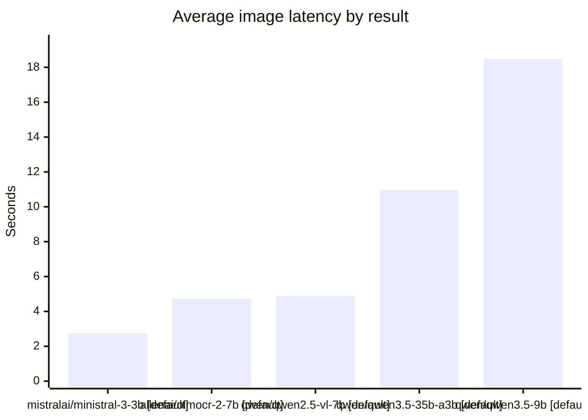

# mac-bench Vision Benchmark

- Ran at: `2026-03-23 17:41:36 UTC`
- Finished at: `2026-03-23 17:47:52 UTC`
- Duration: `0:06:16.133336`
- Machine: `Mac mini` / `Apple M4 Pro` / `64 GB RAM`

## What This Run Tested

- Request profile: `default`
- Temperature: `0.0`
- Max tokens: `160`
- Images: `5`

## Prompt

```text
Describe only the visible person or people in this image in 1 to 2 short sentences. Mention clothing, hats, glasses, masks, shoes, bags, boxes, phones, packages, or other objects they are wearing or carrying. Do not mention the environment, house, porch, background, weather, doorway, camera overlay, or timestamp text unless it is strictly necessary to identify an object on the person. If something is uncertain, say probably or possibly. If no person is visible, reply with exactly: No person visible.
```

## Recommendation

- Recommended result: `mistralai/ministral-3-3b` / `default` at `2.757s` average latency.
- Why: Fastest stable result within the 32 GiB target.
- Lightest stable result: `mistralai/ministral-3-3b` / `default` at `2.78 GiB`.

## Charts

### Speed vs Memory

```mermaid
quadrantChart
    title Speed vs memory footprint
    x-axis Slow --> Fast
    y-axis Low RAM --> High RAM
    quadrant-1 Fast but heavy
    quadrant-2 Best zone
    quadrant-3 Light but slower
    quadrant-4 Heavy and slower
    "mistralai/ministral-3-3b [default]": [1.000, 0.000]
    "allenai/olmocr-2-7b [default]": [0.875, 0.160]
    "qwen/qwen2.5-vl-7b [default]": [0.864, 0.160]
    "qwen/qwen3.5-35b-a3b [default]": [0.477, 1.000]
    "qwen/qwen3.5-9b [default]": [0.000, 0.187]
```

### Average Latency



## Summary

| Model | Profile | Format | Load RAM GiB | Avg s | Median s | Tok/s | Success | Reasoning |
|---|---|---|---:|---:|---:|---:|---:|---|
| `mistralai/ministral-3-3b` | `default` | `gguf` | 2.780 | 2.757 | 2.791 | 14.656 | 5/5 | no |
| `allenai/olmocr-2-7b` | `default` | `gguf` | 5.620 | 4.722 | 4.825 | 4.532 | 5/5 | no |
| `qwen/qwen2.5-vl-7b` | `default` | `gguf` | 5.620 | 4.890 | 5.047 | 5.194 | 5/5 | no |
| `qwen/qwen3.5-35b-a3b` | `default` | `gguf` | 20.560 | 10.979 | 11.590 | 33.864 | 5/5 | yes |
| `qwen/qwen3.5-9b` | `default` | `gguf` | 6.100 | 18.482 | 17.841 | 25.236 | 5/5 | yes |

## Excluded Installed Models

- `qwen/qwen3-vl-8b`: not selected
- `mistralai/devstral-small-2-2512`: not selected
- `nvidia/nemotron-3-nano`: not vision-capable
- `qwen/qwen3-vl-4b`: not selected
- `zai-org/glm-4.7-flash`: not vision-capable
- `zai-org/glm-4.6v-flash`: not selected
- `meta-llama-3.1-8b-instruct-hf`: not vision-capable

## Images

- `01-doorbell-takeout.jpg`: Daytime courier pressing the doorbell with a parcel
- `02-knock-packages.jpg`: Dusk food delivery at the front door
- `03-front-door-dropoff.jpg`: Partial courier frame while leaving parcels on the mat
- `04-delivering-takeout.jpg`: Night delivery driver carrying parcels under the porch light
- `05-online-order-dropoff.jpg`: Empty porch after a delivery with no person visible

## Ministral 3 3B / default

- Model key: `mistralai/ministral-3-3b`
- Identifier used for API: `bench-mistralai-ministral-3-3b`
- Format: `gguf`
- Variant: `mistralai/ministral-3-3b@q4_k_m`
- Params: `3B`
- Estimated total memory: `3.01 GiB`
- Reported load memory: `2.78 GiB`
- Load time: `1.66s`
- Average image latency: `2.757s`
- Median image latency: `2.791s`
- Completion throughput: `14.656 tokens/s`
- Success rate: `5/5`

| Image | Time s | Prompt Tokens | Completion Tokens | Reasoning | Response |
|---|---:|---:|---:|---|---|
| `01-doorbell-takeout.jpg` | 3.338 | 1656 | 44 | no | A man in a dark gray hooded jacket and black gloves is holding a wooden box labeled "UPS" near his body while opening a door. He wears a black cap and appears to be wearing sneakers. |
| `02-knock-packages.jpg` | 2.603 | 1656 | 43 | no | The individual in the image is wearing a dark hooded jacket, a black cap, and appears to be holding a smartphone while standing near an open door. They have a brown paper bag hanging from one hand. |
| `03-front-door-dropoff.jpg` | 2.791 | 1656 | 55 | no | A person in a dark long-sleeved shirt and rolled-up pants is carrying two stacked cardboard boxes while wearing sneakers. The upper body is not fully visible, but there are no hats, glasses, masks, bags, phones, or packages clearly attached to them. |
| `04-delivering-takeout.jpg` | 2.815 | 1656 | 55 | no | A person in a dark jacket, light-colored reflective vest, and brown pants stands holding what appears to be a clipboard or document. They are wearing a white cap and possibly black shoes; they do not have any visible bags, masks, glasses, phones, or packages. |
| `05-online-order-dropoff.jpg` | 2.236 | 1656 | 5 | no | No person visible. |

## Olmocr 2 7B / default

- Model key: `allenai/olmocr-2-7b`
- Identifier used for API: `bench-allenai-olmocr-2-7b`
- Format: `gguf`
- Variant: `allenai/olmocr-2-7b@q4_k_m`
- Params: `7B`
- Estimated total memory: `5.90 GiB`
- Reported load memory: `5.62 GiB`
- Load time: `1.04s`
- Average image latency: `4.722s`
- Median image latency: `4.825s`
- Completion throughput: `4.532 tokens/s`
- Success rate: `5/5`

| Image | Time s | Prompt Tokens | Completion Tokens | Reasoning | Response |
|---|---:|---:|---:|---|---|
| `01-doorbell-takeout.jpg` | 4.847 | 1278 | 18 | no | A man in a dark jacket and gloves is opening a door while holding a package. |
| `02-knock-packages.jpg` | 4.762 | 1278 | 24 | no | A person wearing a dark jacket, hat, and possibly a mask is holding a phone and a brown paper bag. |
| `03-front-door-dropoff.jpg` | 5.044 | 1278 | 37 | no | A man is bending over, placing a cardboard box on top of another box on a porch. He is wearing a dark long-sleeve shirt, cargo pants, and sneakers. |
| `04-delivering-takeout.jpg` | 4.825 | 1278 | 23 | no | A man wearing a white baseball cap, a yellow safety vest, and dark pants is holding an Amazon box. |
| `05-online-order-dropoff.jpg` | 4.133 | 1278 | 5 | no | No person visible. |

## Qwen2.5 VL 7B / default

- Model key: `qwen/qwen2.5-vl-7b`
- Identifier used for API: `bench-qwen-qwen2-5-vl-7b`
- Format: `gguf`
- Variant: `qwen/qwen2.5-vl-7b@q4_k_m`
- Params: `7B`
- Estimated total memory: `5.90 GiB`
- Reported load memory: `5.62 GiB`
- Load time: `1.03s`
- Average image latency: `4.890s`
- Median image latency: `5.047s`
- Completion throughput: `5.194 tokens/s`
- Success rate: `5/5`

| Image | Time s | Prompt Tokens | Completion Tokens | Reasoning | Response |
|---|---:|---:|---:|---|---|
| `01-doorbell-takeout.jpg` | 5.057 | 1278 | 34 | no | A man wearing a dark hoodie and gloves holds a package in his left hand while opening a door with his right hand. He appears to be delivering mail or packages. |
| `02-knock-packages.jpg` | 4.862 | 1278 | 25 | no | A person wearing a dark jacket and hat holds a phone in one hand while carrying a brown paper bag in the other. |
| `03-front-door-dropoff.jpg` | 5.047 | 1278 | 31 | no | A man wearing a dark hoodie and camouflage pants is bending over to place two cardboard boxes on a doormat. He appears to be wearing sneakers. |
| `04-delivering-takeout.jpg` | 5.130 | 1278 | 32 | no | A man wearing a white cap, yellow safety vest over dark clothing, and brown shoes stands in front of a door holding a cardboard box labeled "Amazon." |
| `05-online-order-dropoff.jpg` | 4.354 | 1278 | 5 | no | No person visible. |

## Qwen3.5 35B A3B / default

- Model key: `qwen/qwen3.5-35b-a3b`
- Identifier used for API: `bench-qwen-qwen3-5-35b-a3b`
- Format: `gguf`
- Variant: `qwen/qwen3.5-35b-a3b@q4_k_m`
- Params: `35B-A3B`
- Estimated total memory: `21.25 GiB`
- Reported load memory: `20.56 GiB`
- Load time: `10.52s`
- Average image latency: `10.979s`
- Median image latency: `11.590s`
- Completion throughput: `33.864 tokens/s`
- Success rate: `5/5`

| Image | Time s | Prompt Tokens | Completion Tokens | Reasoning | Response |
|---|---:|---:|---:|---|---|
| `01-doorbell-takeout.jpg` | 10.329 | 999 | 342 | yes | A man wearing a dark green zip-up jacket over a black hoodie and a baseball cap stands at a door. He wears black gloves and holds a brown cardboard box in one hand while reaching for the handle with the other. |
| `02-knock-packages.jpg` | 12.747 | 999 | 456 | yes | A person wearing a dark puffy jacket with the hood pulled up over a baseball cap and dark pants is looking at a lit smartphone held in their hands. They are also carrying a brown paper bag in one hand. |
| `03-front-door-dropoff.jpg` | 11.629 | 999 | 401 | yes | A person wearing a dark long-sleeved shirt and camouflage cargo pants is bending over to handle two stacked cardboard boxes. They are wearing light-colored sneakers. |
| `04-delivering-takeout.jpg` | 11.590 | 999 | 400 | yes | A man wearing a white-fronted baseball cap and a yellow reflective safety vest over dark clothing stands facing a door. He is holding two cardboard boxes in his hands while wearing dark pants and shoes. |
| `05-online-order-dropoff.jpg` | 8.601 | 999 | 260 | yes | No person visible. |

## Qwen3.5 9B / default

- Model key: `qwen/qwen3.5-9b`
- Identifier used for API: `bench-qwen-qwen3-5-9b`
- Format: `gguf`
- Variant: `qwen/qwen3.5-9b@q4_k_m`
- Params: `9B`
- Estimated total memory: `6.85 GiB`
- Reported load memory: `6.10 GiB`
- Load time: `1.15s`
- Average image latency: `18.482s`
- Median image latency: `17.841s`
- Completion throughput: `25.236 tokens/s`
- Success rate: `5/5`

| Image | Time s | Prompt Tokens | Completion Tokens | Reasoning | Response |
|---|---:|---:|---:|---|---|
| `01-doorbell-takeout.jpg` | 26.663 | 999 | 724 | yes | A man wearing a dark baseball cap, a dark hoodie, and an olive green zip-up jacket holds a cardboard box in his left hand while reaching for a door handle with his gloved right hand. |
| `02-knock-packages.jpg` | 22.377 | 999 | 581 | yes | A person wearing a dark hooded jacket and a baseball cap stands holding a smartphone and carrying a brown paper bag. |
| `03-front-door-dropoff.jpg` | 17.675 | 999 | 443 | yes | A person wearing a dark long-sleeved top and dark cargo pants is bending over to handle two cardboard boxes. They are wearing light-colored, dirty sneakers. |
| `04-delivering-takeout.jpg` | 17.841 | 999 | 452 | yes | A man stands on a porch wearing a baseball cap, a dark jacket, a yellow safety vest, and dark pants while holding a cardboard package. |
| `05-online-order-dropoff.jpg` | 7.853 | 999 | 132 | yes | No person visible. |
